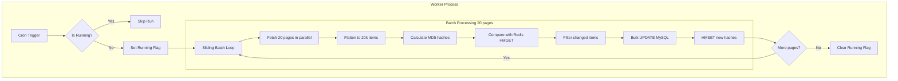

# Automeli Sync Worker Implementation

## Architecture Overview




## Key Files to Create/Modify

### New Files

| File | Purpose ||------|---------|| `src/worker.ts` | Worker entrypoint (createApplicationContext) || `src/app/worker/worker.module.ts` | Worker module with ScheduleModule || `src/app/worker/AutomeliSyncCron.service.ts` | Cron service with sync logic || `src/app/worker/SyncHashService.ts` | MD5 hashing and Redis operations |

### Modified Files

| File | Changes ||------|---------|| [package.json](package.json) | Add `start:worker` script, add `crypto` types || [.github/workflows/deploy.yml](.github/workflows/deploy.yml) | Add pm2 worker process || [src/app/driver/repositories/madre/products/SQLProductMadreRepository.ts](src/app/driver/repositories/madre/products/SQLProductMadreRepository.ts) | Add `bulkUpdateFromAutomeli` method || [src/core/adapters/repositories/madre/products/IProductsRepository.ts](src/core/adapters/repositories/madre/products/IProductsRepository.ts) | Add bulk update interface |

## Implementation Details

### Hash Composition

```typescript
const hash = md5(`${sku}|${meliSalePrice}|${stockQuantity}|${meliStatus}|${manufacturingTime}`);
```


### Redis Structure

- Key: `automeli_products_state` (Redis Hash)
- Field: SKU
- Value: MD5 hash
- Operations: `HMGET` for batch read, `HMSET` for batch write

### Status Mapping

Map `meliStatus` to ProductMadre status:

- `active` -> `'active'`
- Everything else -> `'inactive'`

### Manufacturing Time Parsing

Parse `manufacturingTime` string (e.g., "10 dias") to extract numeric value for `shippingTime`:

```typescript
function parseManufacturingTime(value: string | null): number | null {
  if (!value) return null;
  const match = value.match(/(\d+)/);
  return match ? parseInt(match[1], 10) : null;
}
// "10 dias" -> 10
// "5 días hábiles" -> 5
// null -> null
```


### Fields to Update in ProductMadre

| AutomeliProduct Field | ProductMadre Field | Transformation ||-----------------------|-------------------|----------------|| `meliSalePrice` | `price` (precio) | Direct number || `stockQuantity` | `stock` | Direct number || `meliStatus` | `status` (estado) | Map to 'active'/'inactive' || `manufacturingTime` | `shippingTime` (tiempo_envio) | Extract number from string |

### Bulk Update Strategy

Use raw SQL with `INSERT ... ON DUPLICATE KEY UPDATE` for efficiency:

```sql
INSERT INTO productos_madre (sku, precio, stock, estado, tiempo_envio, updated_at)
VALUES (?, ?, ?, ?, ?, NOW()), ...
ON DUPLICATE KEY UPDATE
  precio = VALUES(precio),
  stock = VALUES(stock),
  estado = VALUES(estado),
  tiempo_envio = VALUES(tiempo_envio),
  updated_at = NOW()
```


### Environment Variables Required

- `AUTOMELI_SELLER_ID` - Single seller ID for API calls
- `AUTOMELI_BASE_URL` - Already exists
- Redis credentials - Already configured

### Cron Schedule

Run twice daily at 6:00 AM and 6:00 PM:

```typescript
@Cron('0 6,18 * * *')
```


### In-Progress Flag

Use Redis key `automeli_sync:running` with TTL (4 hours max) as safety net.

## PM2 Configuration in Deploy

```yaml
pm2 restart madre-worker || pm2 start dist/worker.js --name madre-worker


```